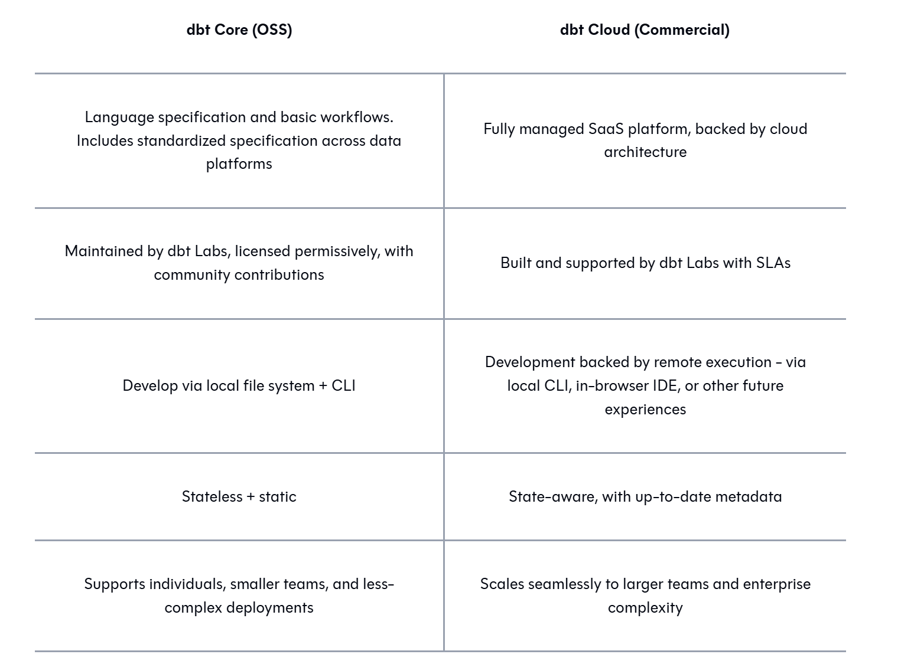

### dbt (data build tool)

**Một cách ngắn gọn:** Nếu **Kimball's Framework** cung cấp *bản thiết kế kiến trúc* (Star Schema, Fact, Dimension) và **Analytics Engineer** là *người thợ thi công chính* để biến dữ liệu thô thành kho dữ liệu hữu ích cho doanh nghiệp, thì **dbt** là *bộ dụng cụ thi công*

---

### Sơ đồ luồng hoạt động tổng thể

```text
[Nguồn dữ liệu thô]
        │
        ▼ (EL Tool: Fivetran, Stitch)
[Staging Area / Raw Data] (Bảng thô trong Warehouse)
        │
        ▼ ───► ANALYTICS ENGINEER dùng dbt (Phần "T" trong ELT)
               • Viết mã SQL chuyển đổi
               • Xây dựng Kimball Model: Dim & Fact
               • Kiểm thử & Kiểm soát phiên bản (Git)
        │
        ▼
[Presentation Area] (Star Schema: Fact & Dimension Tables)
        │
        ▼
[BI Tools: Looker, Power BI, Tableau] (Do Data Analyst / Stakeholder khai thác)

```

**dbt** đóng vai trò là **công cụ cốt lõi (Workhorse)** hỗ trợ xây dựng Dimensional Modeling theo mô hình **ELT (Extract - Load - Transform)** hiện đại:

* **Chuyển đổi dữ liệu chuẩn Kimball bằng SQL thuần:** dbt cho phép Analytics Engineer định nghĩa các bảng Fact và Dimension dưới dạng các file `.sql` đơn giản. dbt tự động biên dịch và chạy các mô hình này trực tiếp bên trong Data Warehouse (BigQuery, Snowflake, Redshift...).
* **Quản lý phụ thuộc (DAG - Directed Acyclic Graph):** dbt tự động hiểu thứ tự phụ thuộc của các bảng. Ví dụ: dữ liệu thô $\rightarrow$ các bảng `stg_` (Staging) $\rightarrow$ các bảng `dim_` / `fct_` (Dimensional) thông qua hàm `ref()`.
* **Áp dụng tư duy lập trình vào Data Modeling:** dbt mang các phương pháp kỹ thuật phần mềm vào việc thiết kế kho dữ liệu:
* **Version Control (Git):** Theo dõi thay đổi của các bảng Fact/Dimension theo thời gian.
* **Testing:** Kiểm tra tính toàn vẹn dữ liệu (đảm bảo Khóa chính/Primary Key không trùng lặp, các quan hệ Foreign Key giữa Fact và Dimension không bị đứt gãy).
* **Documentation:** Tự động tạo tài liệu giải thích ý nghĩa các bảng, các cột và Grain (độ chi tiết) của bảng Fact.

---

## What problems it solves

The transformation step has always existed. What dbt brings to the table is **software engineering best practices for analytics code**. Things that software engineers have been doing for years but didn't have a clear path into the analytics world:

- **Version control** — your transformations live in git, just like any other code
- **Modularity** — break complex logic into reusable pieces instead of massive spaghetti queries
- **Testing** — automated data quality checks that run with every deployment
- **Documentation** — generated from your code, not a separate wiki that gets out of date
- **Environments** — separate dev and prod. Each developer gets their own sandbox to work in without stepping on each other's toes
- **CI/CD** — automated deployments with validation and rollback

The result is higher-quality pipelines that are easier to maintain and less prone to breaking in production.

## How it works — the mechanics

You write a SQL file. It looks like a normal `SELECT` statement. dbt takes that file, figures out where it should go in the warehouse (which schema, which dataset, what environment), wraps it in the necessary DDL/DML, compiles it with any Jinja templating you've used, and runs it.

When you run `dbt run`, it:
1. Compiles your SQL (resolves `ref()` calls, `source()` calls, Jinja macros, everything)
2. Sends the compiled SQL to your warehouse
3. Materializes the result as a table, view, incremental table, or ephemeral CTE — whatever you configured

You don't write `CREATE TABLE` statements yourself. You just write the `SELECT`, and dbt handles the rest.

---

## dbt Core vs dbt Cloud

There are two ways to use dbt, and it's worth understanding the difference:

### dbt Core

Open source. Free. You install it locally on your machine (or wherever) and run commands from the terminal. You're responsible for:

- Setting up your dev environment
- Orchestrating production runs (Airflow, cron jobs, whatever you want)
- Hosting documentation if you want it accessible
- Managing logs and metadata

It's the raw engine. You get full control, but you also have to build the surrounding infrastructure yourself.

### dbt Cloud

SaaS product that runs dbt Core under the hood. It gives you:

- A web-based IDE for writing transformations (or you can use a Cloud CLI if you prefer local development)
- Environment management — dev/staging/prod, all handled for you
- Built-in orchestration (job scheduling, triggers, dependencies)
- Hosted documentation (automatically generated and served)
- Logging and observability
- APIs for administration and metadata access
- A semantic layer for metrics (if you need it)




## How They Were Used Together (Hybrid Approach)
- Common pattern: more technical users worked with dbt Core; less technical users used dbt Cloud
- The two were designed to be **compatible** — e.g. developers could work locally with dbt Core while production runs were executed through dbt Cloud
- dbt Labs published an article in **October 2024** outlining how both products were meant to coexist side by side → [How we think about dbt Core and dbt Cloud](https://www.getdbt.com/blog/how-we-think-about-dbt-core-and-dbt-cloud)

---

dbt Project Structure

---